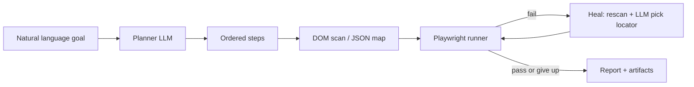

# Sample use case: natural-language regression agent with locator healing

## One-line pitch

A QA automation agent that accepts a goal in plain English (“verify checkout shows tax for California”), runs the flow in a real browser, and **repairs broken steps** when the UI changes by re-reading the DOM and updating locators—without a human opening DevTools.

## Why this use case

- **Pain**: UI churn breaks XPath/CSS selectors; maintenance eats team time; flaky failures are hard to triage.
- **AI fit**: Language models are good at **intent → steps**, **failure text → hypothesis**, and **DOM snapshots → new locators**; your stack already **scrapes interactive elements to JSON** (`qa_dom_scanner.py`) and **resolves single XPaths** (`xpath_agent.py`).
- **Outcome**: Shorter mean time to repair (MTTR) for E2E tests and fewer false “build broken” signals.

## Personas

| Role        | Need                                                |
|------------|-----------------------------------------------------|
| QA engineer| Run regressions without rewriting selectors weekly  |
| Dev lead   | Gate releases on critical journeys with less flakiness |
| SRE/on-call| Quick “is prod checkout alive?” checks from chat    |

## User story

> As a QA engineer, I want to describe a critical user journey in natural language and have an agent execute it in Chrome, produce evidence (screenshots, HAR optional), and automatically suggest updated locators when a step fails, so I spend time judging product risk instead of fixing brittle XPaths.

## Concrete scenario (MVP)

**Goal**: “On the shop homepage, open the cart and confirm the page title or heading contains Cart.”

1. **Plan** (LLM): Decompose into steps, e.g. navigate → find “Cart” control → click → assert heading.
2. **Ground** (your tools): Run `qa_dom_scanner` (or in-process equivalent) on the current URL; map step text to candidate keys in the JSON (fuzzy match on labels/links).
3. **Act** (Playwright): Execute clicks/fills using the chosen XPath; on timeout, capture screenshot + URL + visible error.
4. **Heal** (LLM + scanner): If step *k* fails, re-scan DOM, ask the model to pick the best new XPath from the fresh map for the same intent; retry once or twice with caps.
5. **Report**: Pass/fail, steps log, final locators used, diff of “old vs new” XPath if healed.

## System sketch

## How it uses this repo today

| Component            | Role in the use case                                      |
|---------------------|------------------------------------------------------------|
| `qa_dom_scanner.py` | Build **key → XPath** map per page for grounding steps   |
| `xpath_agent.py`    | Resolve **one** control when the plan names a string       |
| `--stealth` / Chrome| Reduce empty DOM on protected sites (retail, media)       |
| `scans/*.json`      | Auditable snapshot of what the agent “saw”               |

## Success metrics (pilot)

- **Locator heal rate**: % of failed steps recovered without human edit (target: pilot on 1 app, e.g. 40%+ on cosmetic DOM changes).
- **Time**: Minutes from “goal text” to first green run vs. manual script update.
- **Stability**: Same goal, 5 runs: % consistent pass (target: ≥80% on stable staging).

## Non-goals (MVP)

- Replacing full test frameworks (JUnit, pytest, Cypress) overnight.
- Legal/compliance sign-off on prod scraping without policy.
- Perfect accuracy on canvas/WebGL-only UIs without vision.

## Next build steps (if you productize)

1. Thin **orchestrator** CLI: `goal.txt` + `--url` → runs plan/execute/heal loop.
2. **Structured JSON** for plans (steps with `intent`, `action`, `target_hint`).
3. **Golden-file** tests: fixed HTML fixtures + expected healed XPath behavior.
4. Optional **vision** pass when text map has no match (screenshot → region click).

---

*This use case is a sample blueprint; wire your chosen LLM API and keep secrets out of the repo.*
